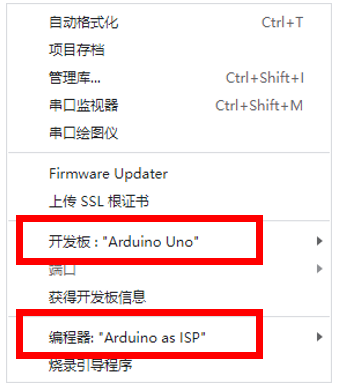

# ButterFly_PCB

创新制造设的同志你们好！这篇文档是        
编辑于2024/03/16

# 目录

项目情况说明：

目前电控板子使用的两个备选方案，互相代替：1是**嘉立创硬创社上的开源项目**提供的板子，2是使用**Arduino_Nano**板子进行控制。这两套方案是我们目前方案中能将控制板质量降得最低的方案，其中嘉立创开源项目的重量最轻，只有**2g**,而备选方案Arduino_Nano芯片较重，有**6g**。以下将说明这两个方案的详细工作目前各自遇到的问题。

## 一、嘉立创硬创社上的开源项目：是组长杨文赞在B站上找到的UP “飞行小匠”（1k菌）提供的一个开源工程，这是该工程的链接：

https://x.jlc.com/platform/detail/c27a173b91834cb99a19e11c7e412f46?type=1

该工程页面如下：

在这个页面上可以找到这个工程所需要的大部分信息，包括PCB板子的引脚、等信息，部分信息需要购买该方案（0元免费购买，只需注册一个账号即可）购买完方案便可查看所有信息并前往下载：

为了方便组员沟通，已将所有可能需要使用的文件提前下载好并附在本文档同一目录。

这个PCB工程已经在嘉立创下单印刷和贴片服务拿到了。板子如下所示，可以发现围绕板子四周有十多个引脚，这些引脚是用来连接电池、两个舵机、遥控接收器以及烧录代码使用的

这张图说明板子的接线方式（背面）：

注意到其中的的icsp端口、串口，这是用来烧录引导程序以及下载控制程序用的。

我们在主页的描述中可以看到这样一句话：

这说明这款板子拿到手时是纯净的，需要我们自己手动烧录程序进去。而这一步便是该项目受到的最大阻碍。

我们的程序不能直接通过串口输入板子里，需要给板子安装底层的引导程序后，他才能像之前用过的Arduino_UNO板子那样接收电脑IDE输入的程序，因此正确烧录程序的步骤是先用ICSP烧录引导程序，再用USB转串口模块把电脑的控制程序输入板子。

笔者在烧录引导程序一步曾按照网上教程做过多次尝试，前面的尝试都失败了，而有一次却意外成功，成功的那次的操作、接线方式与之前的并无差别，没有找到失败或成功的原因。而后在输入控制程序时也遇到问题，至今无法解决。因此决定将之前所作的工作记录以供排查。

### 1.通过icsp烧录引导程序

经过阅读以下教程以及考虑慧园工坊的条件，决定用Arduino_Uno板子为控制板烧录引导程序：

https://blog.csdn.net/haigear/article/details/129203322     
以及        
https://arduino.nxez.com/2018/08/27/several-ways-to-burn-arduino-bootloader.html

提炼一下核心要点，连线方法如图所示：

我们需要用6根杜邦线把Arduino和PCB连起来，其中4根是之前所展示的PCB上的ICSP端口的四个引脚，另外我们还需要1个5V和1个地线给板子上电，一共6根。

上面的图看不太清Arduino_UNO是怎么连的，这个网站有个高清图描述了这款板子的引脚分布：

https://www.cnblogs.com/Bruce_H21/p/11555605.html

其中最主要的是这张图：

注意以下两个部分：

其中左边的是5V和GND两个电源线引脚

我们把它连上**PCB**板的**正负**两个接口

右边四个分别是**10~13**号接口

其与PCB板上接口的对应关系是：

**13-SCK**   
**12-MISO**   
**11-MOSI**     
**10-Reset**  

**注意！！！MISO和MOSI引脚的连线不需要交叉，因为这两个口的方向逻辑跟串口的方向逻辑不一样，它的方向是由主机（Master）和从机（Slave）的从属关系确定的绝对方向，并不是串口中的相对方向。即UNO的MISO就连PCB的MISO，UNO的MOSI就连PCB的MOSI**

当做好以上连线后，给UNO板子连上电脑，PCB的一个红色二极管会常亮
之后就可以打开ArduinoIDE进行烧录了

我们要烧进去的是一个叫ArduinoISP的程序，这个文件是IDE自带的，这样找到它：

打开以后发现是个这样的文件：

在烧录前做好如下设置，确保开发板和编程器选的是对的：

 之后点烧录引导程序

 

如果不出意外的话应该会提示烧录引导程序完成：

 

我烧录的时候忘截图了，这是那个教程博客上的图，总之内容都是一样的，就是这样一句话。我们一共有四个板子，其中两个我做了烧录实验，在盒子里放了“疑似烧录成功”的纸条，之所以说“疑似”是因为除了IDE里报的那个“烧录完成”以外并没有别的检测它烧录成功的手段，且之后的写入控制程序阶段一只出问题，因此不敢保障100%成功了。

### 2.通过串口写入控制程序

引导程序烧录好之后可以写入控制程序了，可以先使用我们自己写的上个学期期末展示时所用的控制代码：

[240104.ino](<Project Files/自己的控制代码/240104.ino>)

也可以用1k菌在他项目中提供的控制代码：

[butterfly_FS1906.ino](<Project Files/仿生蝴蝶&扑翼机控制板/Arduino源代码FS1906-v1.0/butterfly_FS1906.ino>)

两份代码的区别在文末讲解。

总之选一份代码，然后开始进行连线：

使用串口需要这样一个东西：

 

 这是USB转串口模块。一个拇指那么大的板子，被透明塑料套裹着，一头是USB接口，另一头有5根或6根排针。我们在N138薅到一个这种玩意儿，你们可以先用着，跟柯老师说过了。引脚大概是这样分布的：

## 二、使用Arduino_Nano板子进行控制

